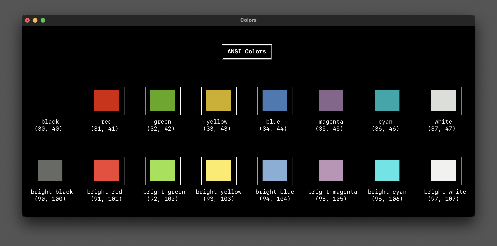
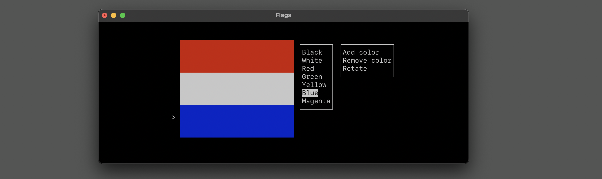
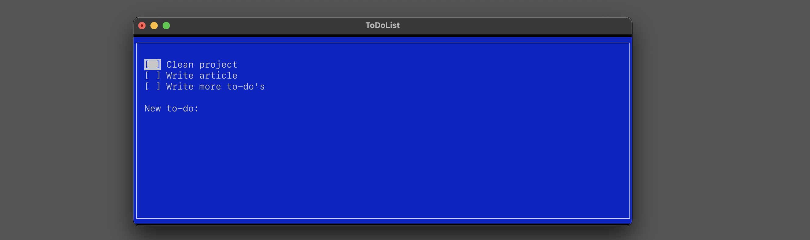

# KeelTUI

KeelTUI is a general-purpose terminal user interface toolkit for Swift applications on macOS 26 and later. It provides a declarative, SwiftUI-inspired API together with reusable lower-level terminal primitives.

## Requirements

- macOS 26 or later
- Swift 6.3 or later, using Swift 6 language mode

## Features

- Declarative view composition with `View`, `@ViewBuilder`, stacks, groups, conditionals, and collections
- State management with `@State`, `@Binding`, `@Environment`, and `@ObservedObject`
- Layout with frames, padding, alignment, spacers, dividers, and geometry readers
- Interactive controls including buttons, text fields, focus movement, and scrolling
- ANSI, xterm, and TrueColor output, plus text and border styling
- Terminal canvas and plain-text or ANSI snapshots
- Unicode-aware display-width handling
- Keyboard decoding, focus coordination, selectable lists, and text viewports
- Tables, panes, modals, status bars, and terminal lifecycle management

## Getting started

Add KeelTUI to an executable Swift package with the following `Package.swift`:

```swift
// swift-tools-version: 6.3

import PackageDescription

let package = Package(
    name: "MyTerminalApp",
    platforms: [
        .macOS(.v26)
    ],
    dependencies: [
        .package(
            url: "https://github.com/uchimanajet7/keel-tui",
            from: "0.1.0"
        )
    ],
    targets: [
        .executableTarget(
            name: "MyTerminalApp",
            dependencies: [
                .product(name: "KeelTUI", package: "keel-tui")
            ]
        )
    ]
)
```

Import the module and start an `Application` with a root view:

```swift
import KeelTUI

struct MyTerminalView: View {
    var body: some View {
        Text("Hello, world!")
    }
}

Application(rootView: MyTerminalView()).start()
```

Run the executable from a terminal emulator:

```bash
swift run
```

## Reusable terminal presentation primitives

`TerminalStatusBar` resolves complete items before it draws. It measures display cells for both outer padding and inter-item separators, shows full labels when they fit, then compacts lower-priority items, and finally omits lower-priority items. Larger `retentionPriority` values are retained longer; when priorities match, later items compact or disappear first. A shortcut, its separating space, and its selected label are always one indivisible item.

`TerminalTextLayout` wraps styled `Character` values without splitting extended grapheme clusters. It preserves explicit newlines and empty lines, carries segment styles across wraps, and supports a styled continuation indent. The `.wordBoundary` policy prefers whitespace boundaries and hard-wraps long tokens; it is deliberately a practical terminal policy rather than a complete Unicode line-breaking implementation. At width zero, each logical input line resolves to one empty output line. A continuation indent is truncated to reserve one content cell. If a single `Character` is wider than the available width, layout keeps it atomic and `TerminalCanvas` leaves it undrawn unless all of its cells fit.

`TerminalModal.layout(in:)` chooses the modal width, wraps at the resulting content width, applies minimum, preferred, and maximum height bounds, and returns normalized viewport metadata. The renderer is stateless: the application owns key handling and passes the desired `scrollOffset` back into the modal.

Define shortcuts once with `TerminalKeyBindingPresentation`, then adapt the same descriptors for a status bar and grouped help. Each consumer must explicitly choose whether disabled bindings are included.

```swift
let bindings = [
    TerminalKeyBindingPresentation(
        id: "refresh",
        shortcut: "r",
        description: "Refresh data",
        compactDescription: "Refresh",
        groupID: "general",
        groupTitle: "General",
        retentionPriority: 20
    ),
    TerminalKeyBindingPresentation(
        id: "quit",
        shortcut: "q",
        description: "Quit",
        groupID: "general",
        groupTitle: "General",
        retentionPriority: 100
    )
]

let status = TerminalStatusBar(
    items: bindings.statusBarItems(disabledVisibility: .exclude)
)
let helpLines = TerminalBindingHelp.lines(
    from: bindings,
    width: 40,
    disabledVisibility: .include
)
let help = TerminalModal(
    title: "Help",
    styledLines: helpLines,
    preferredWidth: 44,
    maximumHeight: 18
)
```

## Examples

The repository includes four executable example packages:

- [Colors](Examples/Colors)
- [Flags](Examples/Flags)
- [Numbers](Examples/Numbers)
- [ToDoList](Examples/ToDoList)

### Colors



### Flags



### ToDoList



Berth uses KeelTUI.

## Provenance

KeelTUI is derived from [rensbreur/SwiftTUI](https://github.com/rensbreur/SwiftTUI), licensed under the MIT License. The original SwiftTUI copyright and license notice are preserved.

[TUIkit](https://github.com/phranck/TUIkit) was consulted only as a feature, user-experience, and behavior reference. No TUIkit source code is included in KeelTUI.

See [LICENSE](LICENSE) and [NOTICE](NOTICE) for attribution and license details.

## Contributing

Contributions that improve KeelTUI as a reusable, general-purpose terminal UI toolkit are welcome.
